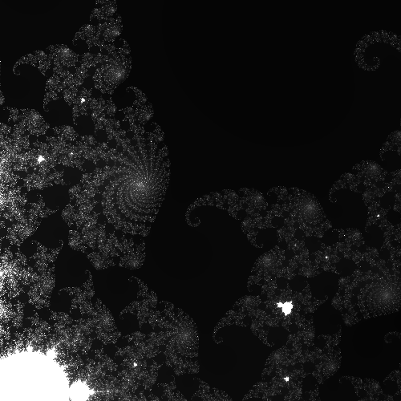
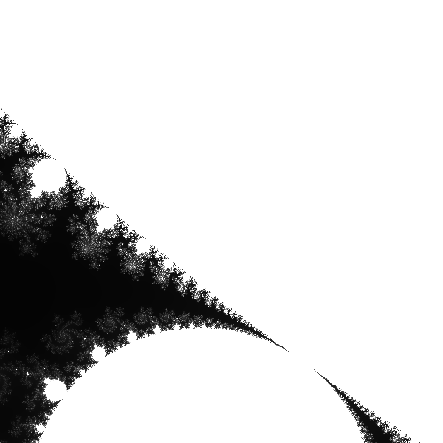
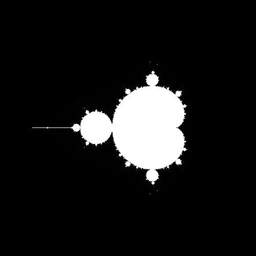
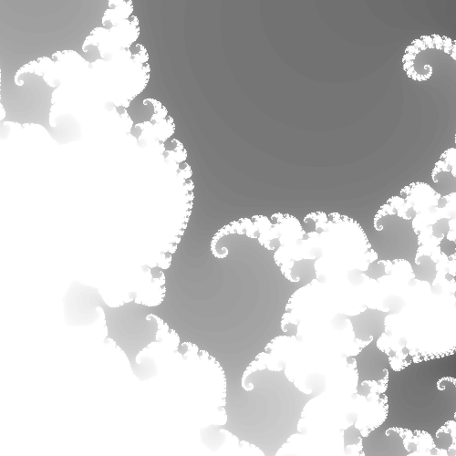

***Name : Viraj Sabhaya***
 
***Class : Operating Systems***
 
***ID : 1001828871***

# Fractal Assignment
 

## Description

- In order to study parallelism, we must have a problem that will take a significant amount
of computation. We will generate images in the Mandelbrot set a well known fractal
structure. The set is interesting both mathematically and aesthetically because it has an
infinitely recursive structure. You can zoom into any part and find swirls, spirals,
snowflakes, and other fun structures, as long as you are willing to do enough computation.

- Run <code>make</code> to build the code. If you run the program with no
arguments, it generates a default image and writes it to <code><i>mandel.bmp</i></code>. You can see all of
the command line options with <code>mandel -h</code>, and use them to override the defaults. 
- This program uses the <code>escape time algorithm</code>. 
- For each pixel in the image, it starts with the x and y position, and then computes a recurrence relation until it exceeds a fixed
value or runs for <i>max</i> iterations.
- Then, the pixel is assigned a color according to the number of iterations completed. An easy color scheme is to assign a gray value proportional to the number of iterations. The max value controls the amount of work done by the algorithm. If we increase max, then we can see much more detail in the set, but it may take much longer to compute. 
  
 
 ---

- Some reference Code to playe with :) 
  <code>./mandel -x -0.5 -y 0 -s 2 -o mandel1.bmp</code> 
  <code>./mandel -x -0.5 -y -0.5 -s 1 -o mandel2.bmp</code> 
  <code>./mandel -x -0.5 -y -0.5 -s 0.005 -o mandel3.bmp</code> 
  <code>./mandel -x -0.5 -y -0.5 -s 0.05 -o mandel3.bmp</code> 
  <code>./mandel -x -0.5 -y -0.5 -s 0.05 -o mandel4.bmp</code> 
  <code>./mandel -x 0.286932 -y 0.014287 -s .0005 -m 50 -o mandel1.bmp</code> 
  <code>./mandel -x 0.286932 -y 0.014287 -s .0005 -m 100 -o mandel2.bmp</code> 
  <code>./mandel -x 0.286932 -y 0.014287 -s .0005 -m 500 -o mandel3.bmp</code> 
  <code>./mandel -x 0.286932 -y 0.014287 -s .0005 -m 1000 -o mandel4.bmp</code> 
  <code>./mandel -x 0.286932 -y 0.014287 -s .0005 -m 2000 -o mandel5.bmp</code> 

---
### Example of the Images Processed : 

|  |  |
|:------------------------------|-------------------------------:|
|  |  |